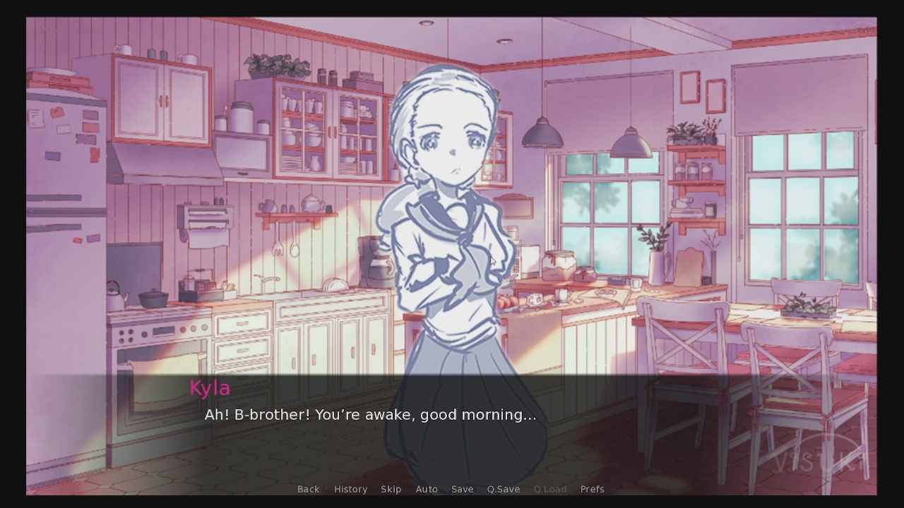
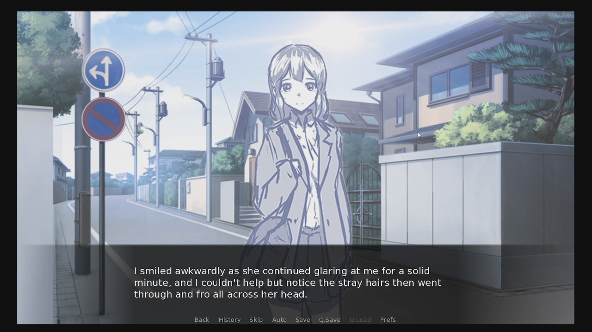
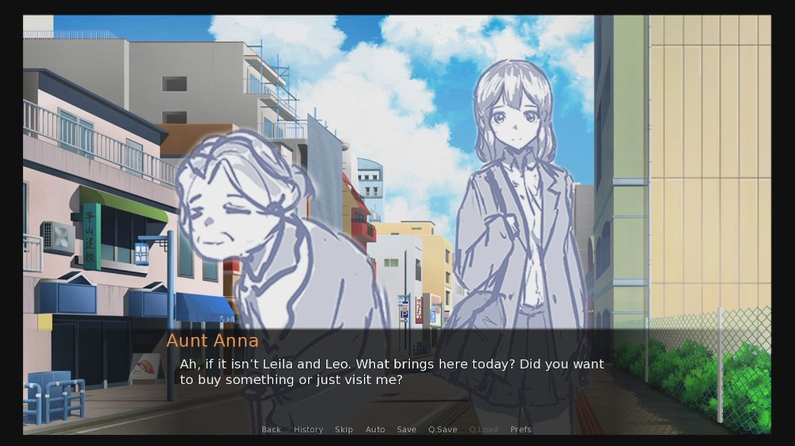

# Yuuka VN - Prototype
<b>Description:</b> 
Yuuka is a work in progress visual novel which tells the story of a young protagonist who obtained a mysterious book by 
chance, granting him passage to the unknown land of 'Australia'. Will he use it for the sake of his world or 'Australia's'?

<b>Installation Instructions:</b> 
Extract the zip file to your desired path, open the folder and run the application either for the 64-bit or 32-bit version.

<b>Controls:</b> 
Use the mouse or the 'Enter' key to read through narrations or dialogues. Choices need to be selected with your mouse and
other features are provided in the dialogue/ narration box.

# Game Screenshots
<b>Screenshot1</b> 
 
<b>Screenshot2</b> 
 
<b>Screenshot3</b> 
 

# Video Sample

# Credits:
Most of the contributors will be credited with their discord names due to personal reasons

# Directed by 
Faliq Aldy Tan

# Written by
MAZTER TEDYZ 
ViolaMagistrate 
MRDoomPlayer 
On The Jon

# Artwork by
Brocollie 
ViolaMagistrate 
Jasminos Micinos

# Music by
Moon Jelly 
Starry Attic

# Special Mentions
Inzult 
Avvvp 
KiburiKageyama

# Special thanks to
Yuuka and VVE for providing an awesome community, allowing me to work with amazing teammates to completing the prototype.

# Legal: We do not own some of the assets used in this project.
# Will take down upon request
